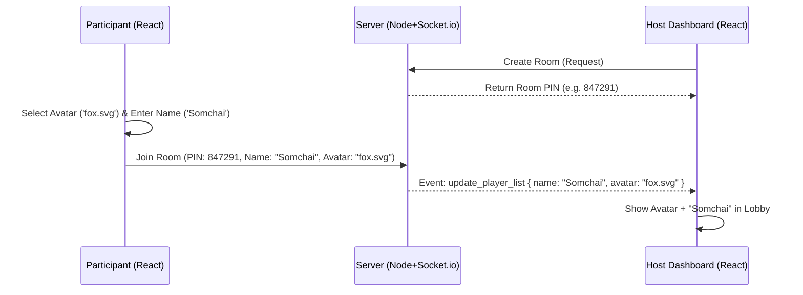

# System Specification: Interactive Quiz & Training Pulse App (Updated with Avatars)

## 1. Project Overview
ระบบแอปพลิเคชันสำหรับการถาม-ตอบแบบเรียลไทม์ (Interactive Response System) ที่ผสมผสานฟีเจอร์เกมตอบคำถาม (Gamified Quiz - สไตล์ Kahoot) และฟีเจอร์สำรวจความเข้าใจระหว่างการฝึกอบรม (Training Pulse / Quick Poll) พร้อมระบบ Avatar ผู้เล่นเพื่อความสนุกสนาน

## 2. Technology Stack
*   **Frontend (ผู้เล่น & หน้าจอโฮสต์):** React + Vite (Fast routing, Client-side rendering)
*   **Backend (เซิร์ฟเวอร์ & API):** Node.js + Express
*   **Real-time Engine:** Socket.io (จัดการ WebSocket, Room, Broadcasting)
*   **In-Memory State / Cache:** Redis (หรือใช้ Memory ของ Node.js ในระยะเริ่มต้น) สำหรับเก็บสถานะห้องและคะแนนชั่วคราว
*   **Database (ตัวเลือกเสริม):** PostgreSQL สำหรับเก็บประวัติการเทรนนิ่ง ชุดคำถาม และรายงานผล
*   **Deployment Environment:** Docker / Docker Compose (เพื่อให้ง่ายต่อการนำไปรันบน Infrastructure ภายในองค์กร)

---

## 3. User Roles
1.  **Host (วิทยากร / แอดมิน):** ผู้สร้างห้อง, ควบคุมสไลด์/คำถาม, เปิด-ปิดการโหวต, และดูหน้าจอแสดงผลรวม (Dashboard/Projector)
2.  **Participant (ผู้เข้าอบรม / ผู้เล่น):** ผู้เข้าร่วมผ่านสมาร์ทโฟนหรือแล็ปท็อปโดยใช้ Room PIN ไม่ต้องติดตั้งแอปพลิเคชัน ไม่ต้องล็อกอิน (Anonymous)

---

## 4. Core Features (ฟีเจอร์หลัก)

### 4.1 Room & Connection Management
*   **Generate PIN:** ระบบสร้างรหัสห้อง 6 หลักอัตโนมัติเมื่อ Host กดสร้างเซสชัน
*   **Avatar Selection:** หน้าจอเข้าห้องให้ผู้เล่นเลือก Avatar ประจำตัว (เป็นภาพ SVG หรือภาพแบบเวกเตอร์) พร้อมกับพิมพ์ชื่อก่อน Join
*   **Join Room:** Participant กรอก PIN, ชื่อ, และเลือก Avatar เพื่อเข้าห้อง
*   **Waiting Lobby:** หน้าจอนับจำนวนและแสดงรูป Avatar พร้อมชื่อผู้เข้าร่วมลอยขึ้นมาแบบเรียลไทม์

### 4.2 Quiz Mode (โหมดเกมตอบคำถาม - สไตล์ Kahoot)
*   **Time-based Scoring:** นับคะแนนจากความถูกต้องและความเร็วในการตอบ
*   **Multiple Choice:** คำถาม 1 ข้อ มี 4 ตัวเลือก
*   **Real-time Leaderboard:** แสดง Top 3 หรือ Top 5 สลับหลังจบแต่ละคำถาม **โดยจะแสดงรูป Avatar ของผู้เล่นคู่กับชื่อและคะแนน**
*   **Host Controls:** Host เป็นคนกด "Next" เพื่อเปลี่ยนคำถามถัดไป

### 4.3 Training Pulse Mode (โหมดเช็กความเข้าใจ - สไตล์ Live Poll)
*   **No Scoring, No Timer:** ไม่มีการคิดคะแนน เน้นการมีส่วนร่วม
*   **Understanding Check (3 Levels):** เขียว (เข้าใจ), เหลือง (ขอตัวอย่างเพิ่ม), แดง (อธิบายซ้ำ)
*   **Live Bar Chart:** หน้าจอ Host แสดงกราฟอัปเดตแบบเรียลไทม์
*   **Seamless Switch:** สลับโหมดโดยผู้เรียนไม่ต้องเข้าห้องใหม่

---

## 5. System Workflows & Flowcharts

### 5.1 System Flow: Join Room with Avatar

---

## 6. Socket.io Event Definitions

### 6.1 Client to Server (ผู้เล่น/โฮสต์ ส่งไปที่ระบบ)
*   `join_room` -> ขอเข้าร่วมห้องด้วย Payload: `{ pin: "123456", name: "Somchai", avatar: "fox.svg" }`
*   *(Event อื่นๆ คงเดิมตามสเปกหลัก)*

### 6.2 Server to Client (ระบบ ส่งไปหาผู้เล่น/โฮสต์)
*   `room_updated` -> อัปเดตรายชื่อและ Avatar คนในห้อง
*   `show_leaderboard` -> ส่งข้อมูลคะแนนสูงสุดพร้อมชื่อและ Avatar
*   *(Event อื่นๆ คงเดิมตามสเปกหลัก)*

---

## 7. แหล่งที่มาของ Avatar Icons 
* svg file ในproject directory name -> pixel-avatars สามาmoveเข้าdir assetได้

---

## 8. Deployment Strategy 
*   **Containerization:** Docker / Docker Compose
*   **Reverse Proxy:** Nginx (รองรับ WebSocket Upgrade)