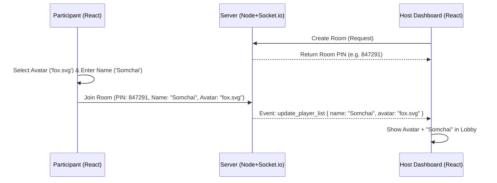

# System Specification: Interactive Quiz & Training Pulse App (Updated with Avatars)

## 1. Project Overview
ระบบแอปพลิเคชันสำหรับการถาม-ตอบแบบเรียลไทม์ (Interactive Response System) ที่ผสมผสานฟีเจอร์เกมตอบคำถาม (Gamified Quiz - สไตล์ Kahoot) และฟีเจอร์สำรวจความเข้าใจระหว่างการฝึกอบรม (Training Pulse / Quick Poll) พร้อมระบบ Avatar ผู้เล่นเพื่อความสนุกสนาน

## 2. Technology Stack
*   **Frontend (ผู้เล่น & หน้าจอโฮสต์):** React 18 + Vite (Fast routing, Client-side rendering, Responsive Touch Support)
*   **Backend (เซิร์ฟเวอร์ & API):** Node.js + Express
*   **Real-time Engine:** Socket.io (จัดการ WebSocket, Room, Broadcasting)
*   **In-Memory State Engine:** `RoomManager` สำหรับควบคุม Live Quiz, Timers, และ Streak คะแนนระดับมิลลิวินาที
*   **Persistence & Database:** Built-in SQLite (`node:sqlite` DatabaseSync with WAL Mode) เก็บ Snapshot ห้อง, ผล Pre-test, และ Roster Players ถาวร
*   **Deployment Environment:** Docker / Docker Compose & Nginx Reverse Proxy

---

## 3. User Roles
1.  **Host (วิทยากร / แอดมิน):** ผู้สร้างห้อง, ควบคุมคำถาม, สลับโหมด Quiz/Pulse, จัดทีม, ดู Leaderboard/Learning Gain, และเปิดเซสชันเดิมต่อ (Resume Room)
2.  **Participant (ผู้เข้าอบรม / ผู้เล่น):** ผู้เข้าร่วมผ่านสมาร์ทโฟนหรือแล็ปท็อปโดยใช้ Room PIN หรือสแกน QR Code ไม่ต้องติดตั้งแอป พร้อมระบบ 1-Click Roster Claim จากรอบ Pre-test

---

## 4. Core Features (ฟีเจอร์หลัก)

### 4.1 Room & Connection Management
*   **Generate PIN:** ระบบสร้างรหัสห้อง 6 หลักอัตโนมัติเมื่อ Host กดสร้างเซสชัน
*   **Avatar Selection:** หน้าจอเข้าห้องให้ผู้เล่นเลือก Avatar ประจำตัว (เป็นภาพ SVG หรือภาพแบบเวกเตอร์) พร้อมกับพิมพ์ชื่อก่อน Join
*   **One-Click Roster Claim:** ในรอบ Post-test ผู้เรียนสามารถแตะเลือกชื่อของตนเองจากรายชื่อที่เคยทำ Pre-test ไว้ได้ในคลิกเดียว ไม่ต้องพิมพ์ใหม่ และป้องกันพิมพ์ชื่อสะกดผิด 100%
*   **Active Sessions Resume:** ผู้สอนสามารถกดเปิดห้องเดิมที่ยังไม่จบหรือรอทำ Post-test ต่อได้ทันที พร้อมแสดง QR Code เดิมขนาดใหญ่
*   **Session Resilience:** รองรับการ Refresh หน้าจอ (F5), การสลับแอป/ย่อหน้าจอ (Background Tab), และการพักเที่ยงโดยข้อมูลไม่สูญหาย

### 4.2 Quiz Mode (โหมดเกมตอบคำถาม - สไตล์ Kahoot)
*   **Time-based Scoring:** นับคะแนนจากความถูกต้องและความเร็วในการตอบ (เต็ม 1,000 คะแนน)
*   **Multiple Choice & Sequence Race:** รองรับทั้งแบบ 4 ช้อยส์ปกติ และแบบแข่งเรียงลำดับขั้นตอน (Drag & Drop)
*   **Real-time Leaderboard:** แสดง Top 3 หรือ Top 5 สลับหลังจบแต่ละคำถาม **โดยจะแสดงรูป Avatar ของผู้เล่นคู่กับชื่อและคะแนน**
*   **Host Controls:** Host เป็นคนกด "Next" เพื่อเปลี่ยนคำถามถัดไป

### 4.3 Pre-test & Post-test Learning Gain Comparison
*   **โหมด Pre-test:** ทดสอบก่อนเรียนโดยไม่แสดงเฉลยช้อยส์และไม่คิดคะแนนดิบ เพื่อเก็บสถิติ Benchmark ความรู้เบื้องต้น
*   **โหมด Post-test (Retest):** ทดสอบหลังเรียนและเปรียบเทียบผลลัพธ์กับรอบ Pre-test แบบรายบุคคล (Learning Gain %) และรายข้อสอบ (Question Shifts)
*   **Most Improved Learner:** ค้นหาผู้เรียนที่มีพัฒนาการก้าวกระโดดสูงสุดเพื่อประกาศผลบน Leaderboard

### 4.4 Training Pulse Mode (โหมดเช็กความเข้าใจ - สไตล์ Live Poll)
*   **No Scoring, No Timer:** ไม่มีการคิดคะแนน เน้นการมีส่วนร่วม
*   **Understanding Check (3 Levels):** เขียว (เข้าใจ), เหลือง (ขอตัวอย่างเพิ่ม), แดง (อธิบายซ้ำ)
*   **Live Bar Chart & Nudge:** หน้าจอ Host แสดงกราฟอัปเดตแบบเรียลไทม์ พร้อมปุ่มส่งสัญญาณสะกิดเตือนผู้เรียนที่ยังไม่ส่งผลประเมิน
*   **Seamless Switch:** สลับโหมดโดยผู้เรียนไม่ต้องเข้าห้องใหม่

---

## 5. System Workflows & Flowcharts

### 5.1 System Flow: Join Room with Avatar

```mermaid
sequenceDiagram
    participant P as Participant (React)
    participant S as Server (Node+Socket.io)
    participant H as Host Dashboard (React)

    H->>S: Create Room (Request)
    S-->>H: Return Room PIN (e.g. 847291)
    
    P->>P: Select Avatar ('fox.svg') & Enter Name ('Somchai')
    P->>S: Join Room (PIN: 847291, Name: "Somchai", Avatar: "fox.svg")
    S-->>H: Event: update_player_list { name: "Somchai", avatar: "fox.svg" }
    H->>H: Show Avatar + "Somchai" in Lobby
```

---

## 6. Socket.io Event Definitions

### 6.1 Client to Server (ผู้เล่น/โฮสต์ ส่งไปที่ระบบ)
*   `join_room` -> ขอเข้าร่วมห้องด้วย Payload: `{ pin: "123456", name: "Somchai", avatar: "fox.svg" }`
*   *(Event อื่นๆ คงเดิมตามสเปกหลัก)*

### 6.2 Server to Client (ระบบ ส่งไปหาผู้เล่น/โฮสต์)
*   `room_updated` -> อัปเดตรายชื่อและ Avatar คนในห้อง
*   `show_leaderboard` -> ส่งข้อมูลคะแนนสูงสุดพร้อมชื่อและ Avatar
*   *(Event อื่นๆ คงเดิมตามสเปกหลัก)*

---

## 7. แหล่งที่มาของ Avatar Icons 
* svg file ในproject directory name -> pixel-avatars สามาmoveเข้าdir assetได้

---

## 8. Deployment Strategy 
*   **Containerization:** Docker / Docker Compose
*   **Reverse Proxy:** Nginx (รองรับ WebSocket Upgrade)