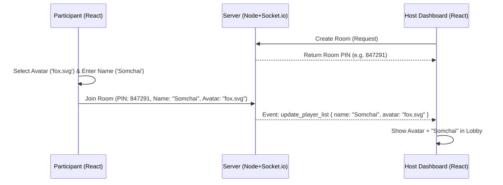
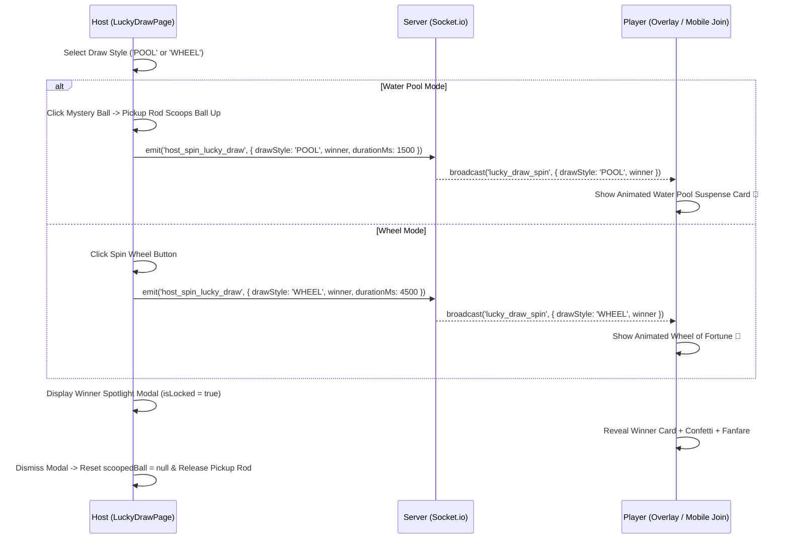

# System Specification: Interactive Quiz & Training Pulse App (Updated with Avatars)

## 1. Project Overview
ระบบแอปพลิเคชันสำหรับการถาม-ตอบแบบเรียลไทม์ (Interactive Response System) ที่ผสมผสานฟีเจอร์เกมตอบคำถาม (Gamified Quiz - สไตล์ Kahoot) และฟีเจอร์สำรวจความเข้าใจระหว่างการฝึกอบรม (Training Pulse / Quick Poll) พร้อมระบบ Avatar ผู้เล่นเพื่อความสนุกสนาน

## 2. Technology Stack
*   **Frontend (ผู้เล่น & หน้าจอโฮสต์):** React 18 + Vite (Fast routing, Client-side rendering, Responsive Touch Support)
*   **Backend (เซิร์ฟเวอร์ & API):** Node.js + Express
*   **Authentication & Security:** JSON Web Token (JWT), `crypto.scryptSync` Password Hashing, Content Security Policy (CSP), In-Memory Rate Limiting
*   **Real-time Engine:** Socket.io (จัดการ WebSocket, Room, Broadcasting, Socket Ownership Guards)
*   **In-Memory State Engine:** `RoomManager` สำหรับควบคุม Live Quiz, Timers, และ Streak คะแนนระดับมิลลิวินาที
*   **Persistence & Database:** Built-in SQLite (`node:sqlite` DatabaseSync with WAL Mode) เก็บ Snapshot ห้อง, ผล Pre-test, Roster Players และบัญชีผู้ใช้ถาวร
*   **Deployment Environment:** Docker / Docker Compose & Nginx Reverse Proxy

---

## 3. User Roles
1.  **Admin (ผู้ดูแลระบบ):** สิทธิ์สูงสุดในการบริหารจัดการระบบ สามารถจัดการบัญชีผู้ใช้งานทั้งหมด (สร้าง/ลบ/เปลี่ยน Role), นำเข้าข้อสอบแบบแทนที่ทั้งหมด (`replaceAll: true`), จัดการคลังคำถาม, สร้างห้องกิจกรรม, และใช้งาน Lucky Draw
2.  **Teacher (อาจารย์ผู้สอน):** ผู้สร้างห้องและจัดการบทเรียน สามารถจัดการคลังข้อสอบของตนเอง, สร้าง/แก้ไข/โคลนชุดคำถาม, ควบคุมห้องกิจกรรม (Quiz / Pulse), สลับโหมด, จัดทีม, และดูบทวิเคราะห์ Learning Gain
3.  **Participant (ผู้เข้าอบรม / ผู้เล่น):** ผู้เข้าร่วมผ่านสมาร์ทโฟนหรือแล็ปท็อปโดยใช้ Room PIN หรือสแกน QR Code ไม่ต้องสมัครสมาชิกหรือติดตั้งแอป พร้อมระบบ 1-Click Roster Claim จากรอบ Pre-test และร่วมกิจกรรม Lucky Draw

---

## 4. Core Features (ฟีเจอร์หลัก)

### 4.1 Room & Connection Management
*   **Generate PIN:** ระบบสร้างรหัสห้อง 6 หลักอัตโนมัติเมื่อ Host กดสร้างเซสชัน
*   **Avatar Selection:** หน้าจอเข้าห้องให้ผู้เล่นเลือก Avatar ประจำตัว (เป็นภาพ SVG หรือภาพแบบเวกเตอร์) พร้อมกับพิมพ์ชื่อก่อน Join
*   **One-Click Roster Claim:** ในรอบ Post-test ผู้เรียนสามารถแตะเลือกชื่อของตนเองจากรายชื่อที่เคยทำ Pre-test ไว้ได้ในคลิกเดียว ไม่ต้องพิมพ์ใหม่ และป้องกันพิมพ์ชื่อสะกดผิด 100%
*   **Active Sessions Resume:** ผู้สอนสามารถกดเปิดห้องเดิมที่ยังไม่จบหรือรอทำ Post-test ต่อได้ทันที พร้อมแสดง QR Code เดิมขนาดใหญ่
*   **Session Resilience:** รองรับการ Refresh หน้าจอ (F5), การสลับแอป/ย่อหน้าจอ (Background Tab), และการพักเที่ยงโดยข้อมูลไม่สูญหาย

### 4.2 Quiz Mode (โหมดเกมตอบคำถาม - สไตล์ Kahoot)
*   **Time-based Scoring:** นับคะแนนจากความถูกต้องและความเร็วในการตอบ (เต็ม 1,000 คะแนน)
*   **Multiple Choice & Sequence Race:** รองรับทั้งแบบ 4 ช้อยส์ปกติ และแบบแข่งเรียงลำดับขั้นตอน (Drag & Drop)
*   **Real-time Leaderboard & 3-Tier Athletic Podium:** แสดงคะแนนแบบ Racing Bar ระหว่างข้อ และเมื่อจบเกม (`isEnded`) จะแสดง **แท่นรับรางวัลสไตล์นักกีฬาโอลิมปิก 3 มิติ (3-Tier Champions Podium)**:
    - อันดับ 1 อยู่ตรงกลางสูงสุดพร้อมมงกุฎลอยได้ 👑, ถ้วยรางวัล, Avatar ขนาดใหญ่, ชื่อ และคะแนน
    - อันดับ 2 อยู่ทางซ้าย (แท่นเงิน) แสดงเหรียญเงิน, Avatar, ชื่อ และคะแนน
    - อันดับ 3 อยู่ทางขวา (แท่นทองแดง) แสดงเหรียญทองแดง, Avatar, ชื่อ และคะแนน
    - แสดงรายชื่ออันดับที่ 4 เป็นต้นไปในกล่องเกียรติยศด้านล่างแท่นรับรางวัล
    - มีปุ่มสลับมุมมองระหว่างแท่น Podium และ Racing Track
*   **First-Look Sequence Intro (การแนะนำกติกาข้อ Sequence ครั้งแรก):**
    - เมื่อระบบพบคำถามแบบ SEQUENCE เป็นข้อแรกในเซสชัน จะไม่เริ่มนับถอยหลัง 5 วินาทีอัตโนมัติ แต่จะหยุดพักที่หน้า **`SEQUENCE_INTRO`**
    - หน้าจอแสดง **CSS Animation นิ้วลากการ์ดสลับที่ (Drag Gesture Demo)** และคำอธิบาย 2 สเต็ป (`1. 👆 ลากสลับลำดับ` ➔ `2. 🚀 กดยืนยันคำตอบ`)
    - วิทยากรสามารถอธิบายกติกาได้เต็มที่ และกดปุ่ม *"ผู้เรียนพร้อมแล้ว เริ่มทำข้อสอบเลย!"* เพื่อเริ่มนับถอยหลังเข้าสู่ข้อสอบพร้อมกัน
    - สำหรับข้อ SEQUENCE ในข้อถัดไป ระบบจะข้ามหน้านี้อัตโนมัติเนื่องจากผู้เรียนเข้าใจวิธีเล่นแล้ว
*   **Host Controls:** Host เป็นคนกด "Next" เพื่อเปลี่ยนคำถามถัดไป

### 4.3 Pre-test & Post-test Learning Gain Comparison
*   **โหมด Pre-test:** ทดสอบก่อนเรียนโดยไม่แสดงเฉลยช้อยส์และไม่คิดคะแนนดิบ เพื่อเก็บสถิติ Benchmark ความรู้เบื้องต้น
*   **โหมด Post-test (Retest):** ทดสอบหลังเรียนและเปรียบเทียบผลลัพธ์กับรอบ Pre-test แบบรายบุคคล (Learning Gain %) และรายข้อสอบ (Question Shifts)
*   **Most Improved Learner:** ค้นหาผู้เรียนที่มีพัฒนาการก้าวกระโดดสูงสุดเพื่อประกาศผลบน Leaderboard

### 4.4 Training Pulse Mode (โหมดเช็กความเข้าใจ - สไตล์ Live Poll)
*   **No Scoring, No Timer:** ไม่มีการคิดคะแนน เน้นการมีส่วนร่วม
*   **Understanding Check (3 Levels):** เขียว (เข้าใจ), เหลือง (ขอตัวอย่างเพิ่ม), แดง (อธิบายซ้ำ)
*   **Live Bar Chart & Nudge:** หน้าจอ Host แสดงกราฟอัปเดตแบบเรียลไทม์ พร้อมปุ่มส่งสัญญาณสะกิดเตือนผู้เรียนที่ยังไม่ส่งผลประเมิน
*   **Seamless Switch:** สลับโหมดโดยผู้เรียนไม่ต้องเข้าห้องใหม่

### 4.5 Lucky Draw Mode (ระบบสุ่มผู้โชคดี & สอยดาวอ่างน้ำ 2.5D)
*   **Dual Visual Models (แยกโหมดการแสดงผล 2 รูปแบบอย่างเด็ดขาด):**
    1.  **Water Pool 2.5D (`drawStyle: 'POOL'`):** อ่างน้ำทรงกระบอก 2.5D Isometric พร้อมลูกบอลปริศนา (Mystery Balls) และกระบองตัก **Pickup Rod** จำลองฟิสิกส์คลื่นน้ำ Concentric Ripples, การช้อนลูกบอลขึ้นพ้นผิวน้ำ (Radial Water Splash), หยดน้ำ (Drips) และประกายแสงสีทอง (Golden Aura & Sparkles)
    2.  **Carnival Lucky Wheel (`drawStyle: 'WHEEL'`):** วงล้อหมุนสุ่มรางวัล 16 ช่องสีสันสดใส ลวดลายไอคอนนำโชค หมุดไฟสีทอง ฟิสิกส์ Deceleration และเข็มกระตุกพร้อมเสียงเอฟเฟกต์
*   **Host vs Player Presentation Model Separation (การแยกโมเดลหน้าจอ Host และ Player):**
    -   **Host Dashboard (`LuckyDrawPage.jsx`):** ทำหน้าที่เป็น Main Arena Stage แสดงผลบนจอใหญ่ ควบคุมการสุ่ม (ไม่แสดง Overlay ทับหน้าจอตัวเองเด็ดขาด)
    -   **Player View (`LuckyDrawPlayerJoin.jsx` / `PlayerLuckyDrawOverlay.jsx`):** 
        -   เมื่อ Host สุ่มด้วย `drawStyle: 'POOL'` ผู้เล่นจะเห็นแอนิเมชันธีมอ่างน้ำลุ้นรางวัล `🌊 กำลังตักลูกบอลในอ่างน้ำ... ✨`
        -   เมื่อ Host สุ่มด้วย `drawStyle: 'WHEEL'` ผู้เล่นจะเห็นแอนิเมชันวงล้อหมุน `<LuckyWheel>`
        -   ทั้ง 2 โหมดแยกจากกันโดยสมบูรณ์ ไม่มีการเรนเดอร์ข้ามหรือทับซ้อนกัน
*   **3 Candidate Sources (แหล่งที่มาของรายชื่อ 3 รูปแบบ):**
    1.  `ROOM`: รายชื่อและ Avatar ผู้เรียนที่กด Join เข้าห้อง Quiz อยู่แล้ว
    2.  `QR`: สแกน QR Code สดในงานเพื่อส่งชื่อเข้าร่วมชิงรางวัลเฉพาะกิจ (Dedicated Lucky Draw Join URL: `/?pin=XXXXXX&luckydraw=1`)
    3.  `MANUAL`: พิมพ์หรือ Paste รายชื่ออิสระ, รองรับการอัปโหลดไฟล์ `.csv` (UTF-8 ภาษาไทย) พร้อมปุ่มดาวน์โหลด Template CSV
*   **Attendance Lock (ระบบล็อกการลงทะเบียน):**
    -   ปุ่มเปิด-ปิดรับรายชื่อแบบเรียลไทม์ (`host_toggle_luckydraw_lock`)
    -   **Auto-lock on Draw:** ตัวเลือกปิดรับรายชื่ออัตโนมัติทันทีที่มีการกดเริ่มสุ่ม เพื่อป้องกันผู้เข้าร่วมกดส่งชื่อแทรกเข้ามาขัดจังหวะการหมุน

### 4.6 Strict Mode Isolation Architecture (การแยกประเภทห้องอย่างเด็ดขาด)
*   **Room Mode Flag (`room.mode`):**
    -   `QUIZ`: ห้องตอบคำถามปกติ (ผูกชุดคำถามจริง, มีคะแนน, คำนวณ Learning Gain)
    -   `PULSE`: ห้องสำรวจความเข้าใจ 3 ระดับ (🟢 🟡 🔴)
    -   `LUCKY_DRAW`: ห้องกิจกรรมสุ่มรางวัลเฉพาะกิจ (กำหนด `isLuckyDraw: true`, ผูกชุดคำถามจำลอง `{ id: 'luckydraw', questions: [] }` **ไม่ผูกชุดข้อสอบปกติมาทับ**)
*   **Active Sessions Filter:**
    -   ฟังก์ชัน `getAllActiveSessions()` บน Server กรองข้าม (`skip`) ห้องที่มี `mode === 'LUCKY_DRAW'` หรือ `isLuckyDraw === true` ทั้งจาก In-Memory และ SQLite
    -   ผลลัพธ์: ห้อง Lucky Draw จะ **ไม่ปรากฏ** ในรายการ "ห้องที่เปิดค้างไว้ / รอทำ Post-test" บนหน้าแรกของผู้สอนโดยเด็ดขาด
*   **Ref-Guarded Room Creation:**
    -   ใน `LuckyDrawPage.jsx` ใช้ `isCreatingRoomRef = useRef(false)` ป้องกัน React 18 Re-render หรือ Strict Mode ยิง `create_room` ซ้ำซ้อนก่อนที่ PIN จะถูกบันทึกลง State
*   **Clean Room Teardown:**
    -   เมื่อผู้ใช้เปิด Lucky Draw จากหน้าแรกแบบ Standalone แล้วกดย้อนกลับ ระบบจะส่ง `socket.emit('close_room')` เพื่อล้างห้องชั่วคราวทิ้งทันที และล้าง Session Storage ไม่ทิ้งห้องขยะตกค้าง

### 4.7 Pickup Rod & Canvas Physics Lifecycle in `LuckyWaterPool`
*   **State Machine ของการตักลูกบอล:**
    1.  **Idle / Hovering:** ลูกบอลลอยตุ๊บป่องตามแรงคลื่นผิวน้ำ กระบอง Pickup Rod เคลื่อนที่ตามเมาส์
    2.  **Scoop Triggered (`state.scoopedBall = target`):** หัว Pickup Rod ล็อกติดกับลูกบอล, ยกลอยขึ้นจากอ่าง, เกิดเอฟเฟกต์น้ำกระจาย (Water Splash) และหยดน้ำ (Drips)
    3.  **Celebration Hold:** เมื่อลูกบอลลอยถึงจุดสูงสุด เกิดวงแหวนออร่าสีทอง (Golden Aura) และประกายวิบวับ (Sparkles) พร้อมส่ง Event `onSelectWinner`
    4.  **Winner Spotlight Modal (`isLocked = true`):** แสดงการ์ดผู้โชคดีกึ่งกลางหน้าจอ โดยลูกบอลและกระบองยังคงลอยตัวส่องประกายอยู่เบื้องหลังอย่างสวยงาม
    5.  **Modal Dismissed (`wasLockedRef.current && !isLocked`):**
        -   เมื่อปิด Modal (กดปุ่ม "สุ่มรางวัลต่อไป", กดปุ่ม `✕` หรือแตะนอกการ์ด)
        -   ระบบจะปลดล็อกสถานะ: `state.scoopedBall = null`, `state.liftProgress = 0`, `state.hasSplashedOnExit = false`
        -   เรียก `initBalls()` เพื่อคำนวณตำแหน่งและแสดงผลลูกบอลที่เหลืออยู่ในอ่างใหม่ทันที พร้อมสำหรับกดตักลูกถัดไปได้อย่างต่อเนื่อง

### 4.8 Backend JWT Authentication & Authorization Model
*   **Database Table `users` (SQLite):**
    -   `id` (INTEGER PRIMARY KEY AUTOINCREMENT)
    -   `username` (TEXT UNIQUE NOT NULL)
    -   `password_hash` (TEXT NOT NULL) — เข้ารหัสด้วย `crypto.scryptSync` (16 bytes random salt)
    -   `display_name` (TEXT NOT NULL)
    -   `role` (TEXT DEFAULT 'TEACHER') — ค่าที่อนุญาต: `'ADMIN'`, `'TEACHER'`
    -   `created_at`, `updated_at` (INTEGER)
*   **Auto-seed Accounts:**
    -   `admin` / `admin1234` (Role: ADMIN)
    -   `teacher` / `teacher1234` (Role: TEACHER)
*   **Password Policy:** บังคับความยาวรหัสผ่านอย่างน้อย 6 ตัวอักษร
*   **REST API Endpoints (`/api/auth`):**
    -   `POST /api/auth/login`: ตรวจสอบรหัสผ่าน คืน JWT Token (อายุ 12 ชั่วโมง) พร้อม Rate Limiter 15 ครั้ง/นาที
    -   `GET /api/auth/me`: ตรวจสอบความถูกต้องของ Token
    -   `POST /api/auth/change-password`: เปลี่ยนรหัสผ่านของตนเอง
    -   `GET /api/auth/users`: รายชื่อผู้ใช้ทั้งหมด (เฉพาะ ADMIN)
    -   `POST /api/auth/users`: สร้างผู้ใช้ใหม่ (เฉพาะ ADMIN)
    -   `DELETE /api/auth/users/:id`: ลบผู้ใช้ (เฉพาะ ADMIN, ห้ามลบบัญชีตัวเอง)
    -   `PATCH /api/auth/users/:id/role`: เปลี่ยนแปลงบทบาทผู้ใช้ (เฉพาะ ADMIN)
*   **Protected Endpoints:**
    -   `POST /api/quizzes`, `POST /api/quizzes/:id/duplicate`, `DELETE /api/quizzes/:id`, `GET /api/quizzes/export`, `POST /api/quizzes/generate-ai`, `POST /api/upload` ต้องมี Bearer JWT Token
    -   `POST /api/quizzes/import` ที่มี `replaceAll: true` อนุญาตเฉพาะบทบาท ADMIN เท่านั้น

### 4.9 Production Security Hardening & Vulnerability Defenses
*   **Content Security Policy (CSP):** กำหนดผ่าน Meta tag ใน `client/index.html` ป้องกัน XSS, Code Injection และควบคุม Endpoint อนุญาต WebSocket
*   **Public Quiz Data Sanitization:** `GET /api/quizzes` ตัด `options.isCorrect` ออกเมื่อเข้าถึงโดยไม่มี Token ครู/แอดมิน เพื่อป้องกันการเปิดดูเฉลยผ่าน Browser Network Inspector
*   **Image Upload Magic Bytes Validation:** ตรวจสอบ Binary Header 4-8 ไบต์แรกของรูปภาพ ป้องกันการเปลี่ยนนามสกุลไฟล์เพื่ออัปโหลด Script หรือ Executable
*   **Socket Impersonation & Ownership Checks:**
    -   `submit_answer`, `submit_pulse`, `leave_room` ตรวจสอบ `socket.id === player.socketId` เพื่อป้องกันผู้เล่นสวมรอยส่งคำตอบแทนคนอื่น
    -   `verifyHost(pin, hostToken)` ป้องกันผู้เล่นทั่วไปส่งคำสั่งของ Host เช่น สลับทีม, สุ่ม Lucky Draw หรือดึงข้อมูล Analytics
    -   `reconnect_host` บังคับตรวจสอบ `hostToken` ตรงกับค่าที่บันทึกไว้ในห้อง ป้องกันการแอบขโมยห้อง Host
*   **Rate Limiting & DoS Mitigations:**
    -   In-memory Token Bucket ป้องกัน Brute-force บน `/api/auth/login`, `/api/quizzes/generate-ai`, และ `/api/upload`
    -   จำกัดผู้เล่นห้องละ 500 คน และจำกัดความถี่ส่ง Reaction 4 ครั้ง/วินาทีต่อคน

---

## 5. System Workflows & Flowcharts

### 5.1 System Flow: Join Room with Avatar

```mermaid
sequenceDiagram
    participant P as Participant (React)
    participant S as Server (Node+Socket.io)
    participant H as Host Dashboard (React)

    H->>S: Create Room (Request)
    S-->>H: Return Room PIN (e.g. 847291)
    
    P->>P: Select Avatar ('fox.svg') & Enter Name ('Somchai')
    P->>S: Join Room (PIN: 847291, Name: "Somchai", Avatar: "fox.svg")
    S-->>H: Event: update_player_list { name: "Somchai", avatar: "fox.svg" }
    H->>H: Show Avatar + "Somchai" in Lobby
```

### 5.2 System Flow: Lucky Draw Dual Engine Lifecycle

```mermaid
sequenceDiagram
    participant H as Host (LuckyDrawPage)
    participant S as Server (Socket.io)
    participant P as Player (Overlay / Mobile Join)

    H->>H: Select Draw Style ('POOL' or 'WHEEL')
    alt Water Pool Mode
        H->>H: Click Mystery Ball -> Pickup Rod Scoops Ball Up
        H->>S: emit('host_spin_lucky_draw', { drawStyle: 'POOL', winner, durationMs: 1500 })
        S-->>P: broadcast('lucky_draw_spin', { drawStyle: 'POOL', winner })
        P->>P: Show Animated Water Pool Suspense Card 🌊
    else Wheel Mode
        H->>H: Click Spin Wheel Button
        H->>S: emit('host_spin_lucky_draw', { drawStyle: 'WHEEL', winner, durationMs: 4500 })
        S-->>P: broadcast('lucky_draw_spin', { drawStyle: 'WHEEL', winner })
        P->>P: Show Animated Wheel of Fortune 🎡
    end
    H->>H: Display Winner Spotlight Modal (isLocked = true)
    P->>P: Reveal Winner Card + Confetti + Fanfare
    H->>H: Dismiss Modal -> Reset scoopedBall = null & Release Pickup Rod
```

---

## 6. Socket.io Event Definitions

### 6.1 Client to Server (ผู้เล่น/โฮสต์ ส่งไปที่ระบบ)
| Event Name | Payloads | คำอธิบาย |
| :--- | :--- | :--- |
| `create_room` | `{ customQuizId?, mode?, isLuckyDraw? }` | วิทยากรสร้างห้องใหม่ (ระบุ `mode: 'LUCKY_DRAW'` สำหรับ Lucky Draw) |
| `join_room` | `{ pin, name, avatar, playerId? }` | ผู้เรียนขอเข้าร่วมห้อง |
| `start_quiz` | `{ pin, hostToken, quizId?, quizMode? }` | วิทยากรเริ่มนับถอยหลัง 5 วินาทีก่อนเข้าข้อแรก |
| `next_question` | `{ pin, hostToken }` | วิทยากรเริ่มนับถอยหลัง 5 วินาทีไปยังคำถามถัดไป |
| `submit_answer` | `{ pin, playerId, optionId?, orderedItemIds? }` | ผู้เรียนส่งคำตอบ (Choice หรือ Sequence) |
| `switch_mode` | `{ pin, hostToken, mode: 'QUIZ' \| 'PULSE' }` | วิทยากรสลับโหมดระหว่าง Quiz และ Pulse |
| `submit_pulse` | `{ pin, playerId, choice: 'green' \| 'yellow' \| 'red' }` | ผู้เรียนส่งระดับความเข้าใจ |
| `send_pulse_nudge` | `{ pin, hostToken }` | วิทยากรกดส่งสัญญาณเตือนคนที่ยังไม่ส่งผลประเมิน |
| `show_leaderboard` | `{ pin, hostToken }` | วิทยากรเรียกดูอันดับคะแนน |
| `reconnect_host` | `{ pin, hostToken }` | วิทยากรเชื่อมต่อกลับเข้าห้องเดิมหลังรีเฟรช |
| `get_active_sessions` | `(ackCallback)` | วิทยากรดึงประวัติห้องที่เปิดค้างไว้จาก SQLite (ไม่รวม Lucky Draw) |
| `host_spin_lucky_draw` | `{ pin, hostToken, prizeName, winner, candidateNames, durationMs, drawStyle }` | วิทยากรสั่งสุ่มรางวัล (ระบุ `drawStyle: 'POOL' \| 'WHEEL'`) |
| `host_close_lucky_draw` | `{ pin, hostToken }` | วิทยากรปิดเซสชัน Lucky Draw |
| `host_toggle_luckydraw_lock` | `{ pin, hostToken, isLocked }` | วิทยากรเปิด/ปิดรับรายชื่อผู้ลงทะเบียน Lucky Draw |
| `get_luckydraw_status` | `{ pin }` | ดึงสถานะล็อกการลงทะเบียนของห้อง Lucky Draw |
| `close_room` | `{ pin, hostToken }` | ปิดห้องและลบข้อมูลห้องออกจาก Memory และ SQLite |

### 6.2 Server to Client (ระบบ ส่งไปหาผู้เล่น/โฮสต์)
| Event Name | Payloads | คำอธิบาย |
| :--- | :--- | :--- |
| `room_created` | `{ pin, mode, status, quizSet, players, counts, hostToken }` | ส่งกลับหาวิทยากรเมื่อสร้างห้องเสร็จ |
| `join_success` | `{ pin, player, mode, status, counts, teamsEnabled, teams }` | ส่งกลับหาผู้เรียนเมื่อเข้าร่วมสำเร็จ |
| `room_updated` | `{ players, counts }` | แจ้งอัปเดตรายชื่อและยอดผู้เล่นในห้อง |
| `question_prepare` | `{ nextQuestionIndex, totalQuestions, countdownSeconds: 5 }` | แจ้งเริ่มนับถอยหลัง 5 วินาทีกลางจอ |
| `question_start` | `{ question, currentQuestionIndex, totalQuestions, totalPlayers }` | เริ่มแสดงคำถามและเปิดรับคำตอบ |
| `question_result` | `{ questionType, correctOptionId?, correctSequence?, optionCounts?, totalPlayers }` | สรุปผลคำตอบและสถิติช้อยส์ |
| `show_leaderboard` | `{ leaderboard, status }` | แสดงอันดับคะแนนผู้เรียน |
| `quiz_ended` | `{ leaderboard, isEnded: true }` | สิ้นสุดเกมและประกาศผล Podium |
| `lucky_draw_spin` | `{ prizeName, winner, candidateNames, durationMs, drawStyle }` | กระจายผลการสุ่มพร้อมระบุสไตล์ (POOL / WHEEL) |
| `lucky_draw_closed` | `{ closedAt }` | แจ้งปิดหน้าจอ Lucky Draw ฝั่งผู้เรียน |
| `luckydraw_lock_updated` | `{ isLocked }` | แจ้งสถานะเปิด/ปิดรับรายชื่อผู้เข้าร่วม Lucky Draw แบบเรียลไทม์ |

---

## 7. แหล่งที่มาของ Avatar Icons 
* ไฟล์ SVG เวกเตอร์ 30 แบบ จัดเก็บอยู่ที่ `client/public/avatars/*.svg` รองรับการสุ่มอัตโนมัติผ่าน `getRandomAvatar()`

---

## 8. Deployment Strategy 
*   **Containerization:** Docker / Docker Compose
*   **Reverse Proxy:** Nginx (รองรับ WebSocket Upgrade & Static Caching)
*   **Persistence:** SQLite database file `./server/data/kaojai.sqlite`

---

## 9. Developer Guidelines: การเพิ่มหรือปรับแต่งโหมดกิจกรรมใหม่ (Adding New Modes)

สำหรับผู้พัฒนาที่จะมาดูแลหรือต่อยอดโปรเจกต์ KaoJai ในอนาคต ให้ปฏิบัติตามมาตรฐานสถาปัตยกรรมดังนี้:

### 1. การกำหนดโหมดที่ฝั่ง Server (`server/src/roomManager.js` & `db.js`):
- ตรวจสอบ `mode` ในฟังก์ชัน `createRoom(hostSocketId, customQuizSetOrId)`:
  - กำหนดค่า `room.mode` ให้ชัดเจน (เช่น `'QUIZ'`, `'PULSE'`, `'LUCKY_DRAW'` หรือโหมดใหม่ของคุณ)
  - หากโหมดใหม่ไม่มีข้อสอบแบบ Choice/Sequence ให้ระบุ Dummy Quiz Object ป้องกันเซิร์ฟเวอร์ดึงข้อสอบจาก `getAllQuizzes()[0]` มาผูกทับ
- ในฟังก์ชัน `getAllActiveSessions()`:
  - หากโหมดใหม่ไม่ใช่ห้องทำข้อสอบ Pre/Post-test ให้เพิ่มเงื่อนไข `if (r.mode === 'YOUR_NEW_MODE') continue;` เพื่อป้องกันห้องไปโผล่ในรายการ Resume ที่หน้าแรก
- ในฐานข้อมูล `db.js`: คอลัมน์ `rooms.mode` รองรับค่า TEXT ได้ทันที

### 2. การจัดการ Routing & State ที่ฝั่ง Client (`client/src/App.jsx` & `SocketContext.jsx`):
- ใน `SocketContext.jsx`:
  - หากโหมดนั้นมีสถานะ Session แยกเฉพาะ ให้บันทึก Flag ใน `saveSessionData` และล้างใน `clearSession`
- ใน `App.jsx`:
  - ตัวแปร `viewMode`: จัดการการแสดงผลแบบ Exclusive Routing
  - ใน Listener `onRoomCreated` และ `onHostReconnected`: ตรวจสอบ `data.mode` เพื่อรักษาสถานะ `viewMode` ให้ตรงกับโหมดกิจกรรม และไม่ถูกเปลี่ยนเป็น `'HOST_GAME'` โดยไม่ได้ตั้งใจ
  - ในคอมโพเนนต์ Overlay (เช่น `PlayerLuckyDrawOverlay`): **ต้องใส่เงื่อนไขตรวจสอบว่าผู้ใช้เป็น Player จริงๆ เสมอ** (`viewMode === 'PLAYER_GAME' && !session?.isHost`) เพื่อไม่ให้ Modal เด้งขึ้นมาบังจอของ Host
- เมื่อผู้ใช้ออกจากโหมดกิจกรรมกลับสู่หน้าแรก:
  - ให้เรียก `socket.emit('close_room')` สำหรับห้องเฉพาะกิจ เพื่อปิดห้องและล้างข้อมูลทั้งใน Memory และ SQLite ทันที

### 3. ข้อกำหนดด้านความปลอดภัยของ Terminal (EDR / Security Rules):
- **ห้ามสั่งการ PowerShell โดยตรงเป็นอันขาด**: ระบบเครื่องมี EDR ตรวจจับคำสั่ง PowerShell ดิบ
- **ต้องรันคำสั่งผ่าน `cmd.exe /c "..."` เสมอ** เช่น `cmd.exe /c "npm test"` หรือ `cmd.exe /c "npm run build"`
